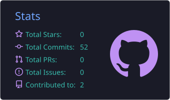
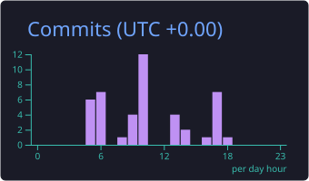
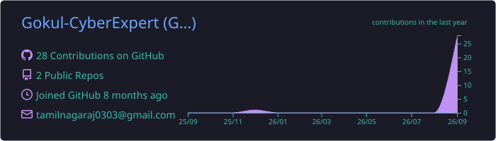
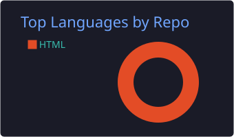
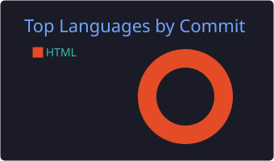

# Hi 👋, I'm Gokul N

### 🛡️ Cyber Security Student | Tech Explorer | Future Builder

<p align="center">
  
</p>

<p align="center">
  
</p>

---

## 🎯 About Me

<div align="center">

<table>
<tr>
<td width="55%" valign="top" align="left">

```python
gokul = {
    "name": "Gokul N",
    "role": "Cyber Security Student",
    "education": "B.E. CSE - Cyber Security",
    "location": "Tamil Nadu, India 🇮🇳",

    "focus": [
        "Cyber Security",
        "Ethical Hacking",
        "Web Security",
        "Full Stack Development",
        "Artificial Intelligence"
    ],

    "currently_learning": [
        "Python",
        "Data Structures & Algorithms",
        "Ethical Hacking",
        "Web Application Security",
        "AI & Machine Learning"
    ],

    "mindset": "Learn • Build • Break • Secure • Repeat"
}
```

<i>"Learning technology by building real things
and understanding how they work."</i>

</td>
<td width="45%" valign="middle" align="center">


</td>
</tr>
</table>

</div>

---

## 🛡️ Cyber Security

<p align="center">
  
</p>

### 🔐 Areas I'm Exploring

* 🔎 Web Application Security
* 🧪 Ethical Hacking & Penetration Testing
* 🌐 Network Security
* 🐞 Vulnerability Discovery
* 🔥 OWASP Top 10
* 🧰 Burp Suite
* 🖥️ Linux & Kali Linux
* 🎯 Capture The Flag (CTF)
* 📊 SOC & Security Fundamentals
* 🧩 Hack The Box
* 🌐 PortSwigger Web Security Academy

---

## 💻 Tech Stack

### 🐍 Programming

<p align="center">
  
</p>

### ⚛️ Frontend & Mobile

<p align="center">
  
</p>

### ⚙️ Backend & Database

<p align="center">
  
</p>

### 🤖 AI & Machine Learning

<p align="center">
  
</p>

<p align="center">
  
  
  
</p>

### ☁️ Tools & Platforms

<p align="center">
  
</p>

### 🎨 Design & Creative

<p align="center">
  
</p>

<p align="center">
  
</p>

## 📚 Currently Learning

<p align="center">
  
  
  
  
  
</p>

---

## 🌐 Connect With Me

<p align="center">
  <a href="mailto:tamilnagaraj0303@gmail.com">
    
  </a>
  &nbsp;
  <a href="https://x.com/gokul2207pt">
    
  </a>
  &nbsp;
  <a href="https://github.com/Gokul-CyberExpert">
    
  </a>
</p>

## 📊 GitHub Analytics

<p align="center">
  
  
</p>

<p align="center">
  
</p>

<p align="center">
  
  
  
</p>

---

## 🐍 Contribution Snake

<p align="center">
  <picture>
    <source
      media="(prefers-color-scheme: dark)"
      srcset="https://raw.githubusercontent.com/Gokul-CyberExpert/Gokul-CyberExpert/output/github-contribution-grid-snake-dark.svg"/>
    <source
      media="(prefers-color-scheme: light)"
      srcset="https://raw.githubusercontent.com/Gokul-CyberExpert/Gokul-CyberExpert/output/github-contribution-grid-snake.svg"/>
    
  </picture>
</p>

---

<p align="center">
  
</p>

<p align="center">
  <b>🚀 Learn • Build • Secure • Repeat</b>
</p>
